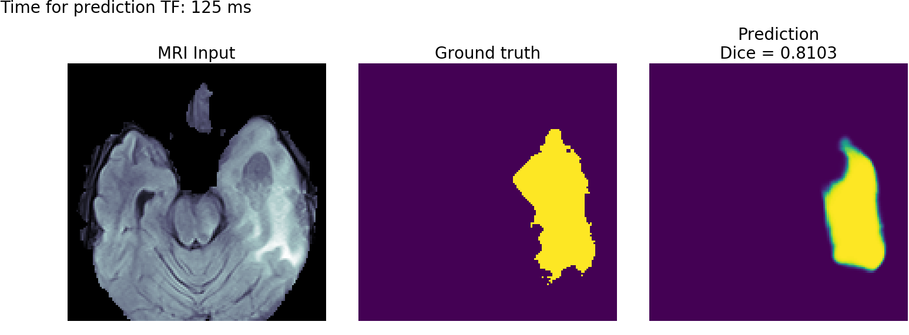
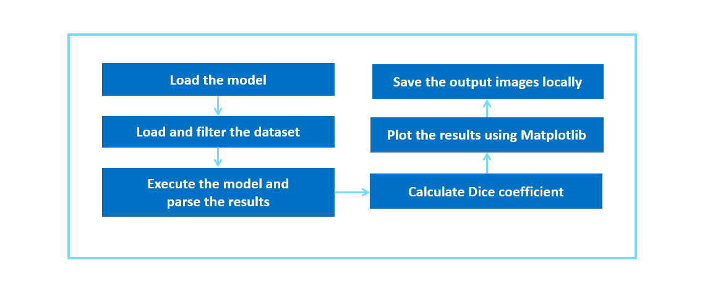

# Brain Tumor Segmentation (BraTS) with MKL-DNN

| Details           |              |
|-----------------------|---------------|
| Target OS:            |  Ubuntu\* 16.04 LTS   |
| Programming Language: |  Python* 3.5 |
| Time to Complete:    |  30-40min     |



## What it does

This reference implementation applies the U-Net architecture to segment brain tumors from raw MRI scans. The application plots the brain tumor matter segmented and calculates the [Dice coefficient](https://en.wikipedia.org/wiki/S%C3%B8rensen%E2%80%93Dice_coefficient) between ground truth and the predicted result.

## Requirements
### Hardware
* 6th to 8th Generation Intel® Core™ processor with Iris® Pro graphics or Intel® HD Graphics

### Software
* [Ubuntu\* 16.04 LTS](http://releases.ubuntu.com/16.04/)<br>
   *Note*: We recommend using a 4.14+ Linux* kernel with this software. Run the following command to determine your kernel version:

      uname -a
* TensorFlow*
* Keras*
* Matplotlib
* Miniconda


## How It works

The application uses MRI scans as the input data source. The results from the model are used to calculate Dice coefficient and to plot prediction results of the brain tumor matter segmented.



The Dice coefficient (the standard metric for the BraTS dataset used in the study) for our model is about 0.82-0.88. Menze et al. [reported]( https://ieeexplore.ieee.org/document/6975210 ) that expert neuroradiologists manually segmented these tumors with a cross-rater Dice score of 0.75-0.85, meaning that the model’s predictions are on par with what expert physicians have made. The below MRI brain scan highlight brain tumor matter segmented using deep learning.


### What is U-Net?  
The [U-Net]( https://en.wikipedia.org/wiki/U-Net) architecture has been used to create deep learning models for [segmenting nerves]( https://github.com/jocicmarko/ultrasound-nerve-segmentation) in ultrasound  images, [lungs]( https://www.kaggle.com/c/data-science-bowl-2017#tutorial ) in CT scans, and even [interference]( https://github.com/jakeret/tf_unet ) in radio telescopes.

U-Net is designed like an [auto-encoder]( https://en.wikipedia.org/wiki/Autoencoder ). It has an encoding path (“contracting”) paired with a decoding path (“expanding”) which gives it the “U” shape. However, in contrast to the autoencoder, U-Net predicts a pixelwise segmentation map of the input image rather than classifying the input image as a whole. For each pixel in the original image, it asks the question: “To which class does this pixel belong?” This flexibility allows U-Net to predict different parts of the tumor simultaneously.


## Setup

### Get the code

Clone the reference implementation:
```
sudo apt-get update && sudo apt-get install git
git clone https://github.com/intel-iot-devkit/brain-tumor-segmentations.git
``` 

### Dependencies

#### Miniconda
Miniconda is essentially an installer for an empty conda environment, containing only Conda, its dependencies, and Python. Once Conda is installed, you can then install whatever package you need from scratch along with any desired version of Python.<br>
Install the Miniconda using the below commands:
```
wget -O Miniconda3-latest-Linux-x86_64.sh https://repo.anaconda.com/miniconda/Miniconda3-latest-Linux-x86_64.sh
chmod +x Miniconda3-latest-Linux-x86_64.sh
./Miniconda3-latest-Linux-x86_64.sh
source ~/.bashrc
```
**Note:** Restart the terminal for the changes to take effect.

#### NumPy
NumPy is a library for the Python programming language, adding support for large, multi-dimensional arrays and matrices, along with a large collection of high-level mathematical functions to operate on these arrays.

#### Matplotlib
Matplotlib is a plotting library for the Python programming language and its numerical mathematics extension NumPy. It provides an object-oriented API for embedding plots into applications.

#### TensorFlow
TensorFlow is a free and open-source software library for dataflow and differentiable programming across a range of tasks. It is a symbolic math library, and is also used for machine learning applications such as neural networks.

#### Keras
Keras is an open-source neural-network library written in Python. It is capable of running on top of TensorFlow or Theano*. It offers a higher-level, more intuitive set of abstractions that make it easy to develop deep learning models regardless of the computational backend used.

### Which model to use
This application uses a pre-trained model (unet_model_for_decathlon.hdf5), that is provided in the `/resources` directory. This model is trained using the __Task01_BrainTumour.tar__ dataset from the [Medical Segmentation Decathlon](http://medicaldecathlon.com/), made available under the [(CC BY-SA 4.0)](https://creativecommons.org/licenses/by-sa/4.0/) license. Instructions on how to train your model can be found here [https://github.com/IntelAI/unet/tree/master/2D](https://github.com/IntelAI/unet/tree/master/2D)

To install the dependencies of the RI and to optimize the pre-trained model, run the following command:

    cd <path_to_the_brain_tumor_segmentation_MKL-DNN_directory>
    ./setup.sh

### What Input to use

The application uses the MRI scans from __Task01_BrainTumour.h5__ that is provided in __/resources__ directory.

## Setup the environment
Activate the virtual environment of MKL using the below command:
```
conda activate mkltf
``` 

## Run the Application
Change the current directory to the git-cloned application code location on your system:
```
cd <path_to_the_brain_tumor_segmentation_MKL-DNN>/application
```

To see a list of the various options:
```
python3 brain_tumor_segmentation.py -h
```

To run the application, use the below command:
```
python3 brain_tumor_segmentation.py --data_file ../resources/Task01_BrainTumour.h5 --inference_filename ../resources/unet_model_for_decathlon.hdf5 -r ../results
```

**Note:**<br>
1. To deactivate the conda environment, use the ```conda deactivate``` command:
2. To run the application on tensorflow environment, follow the below steps:
    * Activate the tensorflow virtual environment using the following command:
        ```
        conda activate stocktf
        ```
    * To run the application, use the below command:
        ```
        python3 brain_tumor_segmentation.py --data_file ../resources/Task01_BrainTumour.h5 --inference_filename ../resources/unet_model_for_decathlon.hdf5 -r ../results
        ```