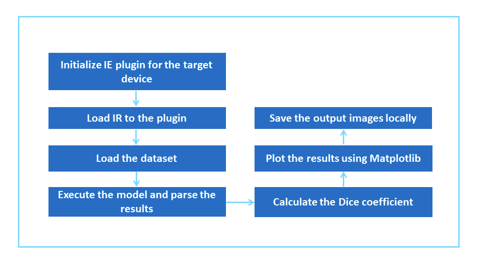
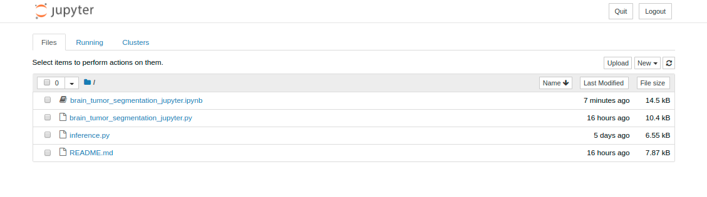

# Brain Tumor Segmentation (BraTS) with OpenVINO™

| Details           |              |
|-----------------------|---------------|
| Target OS:            |  Ubuntu\* 16.04 LTS   |
| Programming Language: |  Python* 3.5 |
| Time to Complete:    |  30-40min     |


## What it does

This reference implementation applies the U-Net architecture to segment brain tumors from raw MRI scans. The application plots the brain tumor matter segmented and calculates the [Dice coefficient](https://en.wikipedia.org/wiki/S%C3%B8rensen%E2%80%93Dice_coefficient) between ground truth and the predicted result.

## Requirements
### Hardware
* 6th to 8th Generation Intel® Core™ processor with Iris® Pro graphics or Intel® HD Graphics

### Software
* [Ubuntu\* 16.04 LTS](http://releases.ubuntu.com/16.04/)<br>
   *Note*: We recommend using a 4.14+ Linux* kernel with this software. Run the following command to determine your kernel version:

      uname -a
  
* OpenCL™ Runtime Package
* Intel® Distribution of OpenVINO™ toolkit 2019 R2 Release
* Jupyter

## How It works

The application uses MRI scans as the input data source. The results from the model are used to calculate Dice coefficient and to plot prediction results of the brain tumor matter segmented.



The Dice coefficient (the standard metric for the BraTS dataset used in the study) for our model is about 0.82-0.88. Menze et al. [reported]( https://ieeexplore.ieee.org/document/6975210 ) that expert neuroradiologists manually segmented these tumors with a cross-rater Dice score of 0.75-0.85, meaning that the model’s predictions are on par with what expert physicians have made. The below MRI brain scans highlight brain tumor matter segmented using deep learning.


### What is U-Net?  
The [U-Net]( https://en.wikipedia.org/wiki/U-Net ) architecture has been used to create deep learning models for segmenting [nerves]( https://github.com/jocicmarko/ultrasound-nerve-segmentation ) in ultrasound  images, [lungs]( https://www.kaggle.com/c/data-science-bowl-2017#tutorial ) in CT scans, and even [interference]( https://github.com/jakeret/tf_unet ) in radio telescopes.

U-Net is designed like an [auto-encoder]( https://en.wikipedia.org/wiki/Autoencoder ). It has an encoding path (“contracting”) paired with a decoding path (“expanding”) which gives it the “U” shape. However, in contrast to the autoencoder, U-Net predicts a pixelwise segmentation map of the input image rather than classifying the input image as a whole. For each pixel in the original image, it asks the question: “To which class does this pixel belong?” This flexibility allows U-Net to predict different parts of the tumor simultaneously.


## Setup

### Get the code

Clone the reference implementation:
```
sudo apt-get update && sudo apt-get install git
git clone https://gitlab.devtools.intel.com/reference-implementations/brain-tumor-segmentations-python.git
``` 

### Install the Intel® Distribution of OpenVINO™ toolkit
Refer to [Install Intel® Distribution of OpenVINO™ toolkit for Linux*](https://software.intel.com/en-us/articles/OpenVINO-Install-Linux) on how to install and setup the Intel® Distribution of OpenVINO™ toolkit.

You will need the OpenCL™ Runtime Package if you plan to run inference on the GPU. It is not mandatory for CPU inference.

### Other dependencies

#### Numpy
NumPy is a library for the Python programming language, adding support for large, multi-dimensional arrays and matrices, along with a large collection of high-level mathematical functions to operate on these arrays.

#### Matplotlib
Matplotlib is a plotting library for the Python programming language and its numerical mathematics extension NumPy. It provides an object-oriented API for embedding plots into applications.

### Which model to use
This application uses a pre-trained model (unet_model_for_decathlon.hdf5), that is provided in the `/resources` directory. This model is trained using the __Task01_BrainTumour.tar__ dataset from the [Medical Segmentation Decathlon](http://medicaldecathlon.com/), made available under the [(CC BY-SA 4.0)](https://creativecommons.org/licenses/by-sa/4.0/) license. Instructions on how to train your model can be found here [https://github.com/IntelAI/unet/tree/master/2D](https://github.com/IntelAI/unet/tree/master/2D). This model needs to be passed through the **model optimizer** to generate the IR (the __.xml__ and __.bin__ files) that will be used by the application.

To install the dependencies of the RI and to optimize the pre-trained model, run the following command:

    cd <path_to_the_Brain_Tumor_Segmentaion_OpenVINO_directory>
    ./setup.sh

### What Input to use

The application uses MRI scans from __Task01_BrainTumour.h5__, that is provided in the `/resources` directory.

## Setup the environment
You must configure the environment to use the Intel® Distribution of OpenVINO™ toolkit one time per session by running the following command:

    source /opt/intel/openvino/bin/setupvars.sh -pyver 3.5
    
__Note__: This command needs to be executed only once in the te 2018 (Menze et arminal where the application will be executed. If the terminal is closed, the command needs to be executed again.
    
## Run the Application on Jupyter*

Go to the _Brain_Tumor_Segmentaion_OpenVINO_directory_ and open the Jupyter notebook by running the following commands:

    cd <path_to_the_Brain_Tumor_Segmentaion_OpenVINO_directory>/Jupyter
 
    jupyter notebook


#### Follow the steps to run the code on Jupyter*:



1. Click on **New** button on the right side of the Jupyter window.

2. Click on **Python 3** option from the drop down list.

3. In the first cell type **import os** and press **Shift+Enter** from the keyboard.

4. Export the below environment variables in second cell of Jupyter and press **Shift+Enter**.<br>
    ```
    %env MODEL = ../resources/output/IR_models/FP32/saved_model.xml
    %env DEVICE = CPU
    %env CPU_EXTENSION = /opt/intel/openvino/inference_engine/lib/intel64/libcpu_extension_avx2.so
    %env DATA_FILE = ../resources/Task01_BrainTumour.h5
    %env RESULTS = ../results/
    ```
    **NOTE:** To print layer by layer inference times of the application, export the environment variable **%env STATS = True**.
   
5. Copy the code from **brain_tumor_segmentation_jupyter.py** and paste it in the next cell and press **Shift+Enter**.

6. Alternatively, code can be run in the following way.

    i. Click on the **brain_tumor_segmentation_jupyter.ipynb** file in the Jupyter notebook window.
    
    ii. Click on the **Kernel** menu and then select **Restart & Run All** from the drop down list.
    
    iii. Click on Restart and Run All Cells.

    

**NOTE:**

1. To run the application on **GPU**:
     * With the floating point precision 32 (FP32), change the **%env DEVICE = CPU** to **%env DEVICE = GPU**<br>
     **FP32**: FP32 is single-precision floating-point arithmetic uses 32 bits to represent numbers. 8 bits for the magnitude and 23 bits for the precision. For more information, [click here](https://en.wikipedia.org/wiki/Single-precision_floating-point_format)<br>

     * With the floating point precision 16 (FP16), 
       
       * change the **%env DEVICE = CPU** to **%env DEVICE = GPU**
       * Set the path of the FP16 model in the environment variable `MODEL` as given below: <br>
       **%env MODEL = ../resources/output/IR_models/FP16/saved_model.xml** <br>
       
       **FP16**: FP16 is half-precision floating-point arithmetic uses 16 bits. 5 bits for the magnitude and 10 bits for the precision. For more information, [click here](https://en.wikipedia.org/wiki/Half-precision_floating-point_format)

     * **CPU_EXTENSION** environment variable is not required.
   
2. To run the application on **Intel® Neural Compute Stick**: 
      * Change the **%env DEVICE = CPU** to **%env DEVICE = MYRIAD**.  
      * The Intel® Neural Compute Stick can only run FP16 models. Set the path of the FP16 model in the environment variable `MODEL` as given below: <br>
       **%env MODEL = ../resources/output/IR_models/FP16/saved_model.xml** <br>        
      * **CPU_EXTENSION** environment variable is not required.

3. To run the application on **Intel® Movidius™ VPU**:
      * Change the **%env DEVICE = CPU** to **%env DEVICE = HDDL**
      * The Intel® Movidius™ VPU can only run FP16 models. Set the path of the FP16 model in the environment variable `MODEL` as given below: <br>
      **%env MODEL = ../resources/output/IR_models/FP16/saved_model.xml** <br>
      * **CPU_EXTENSION** environment variable is not required.
