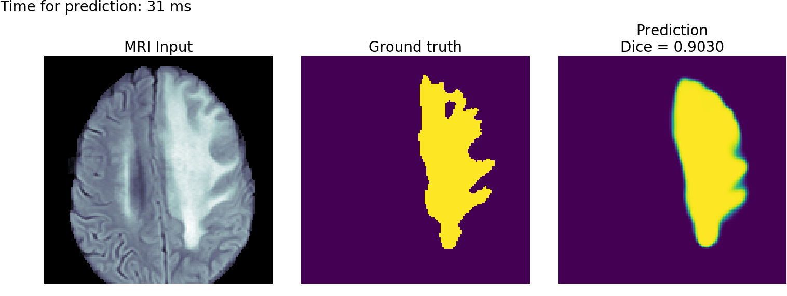
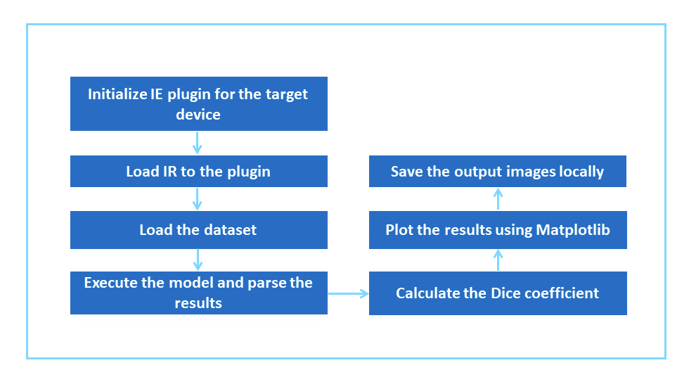
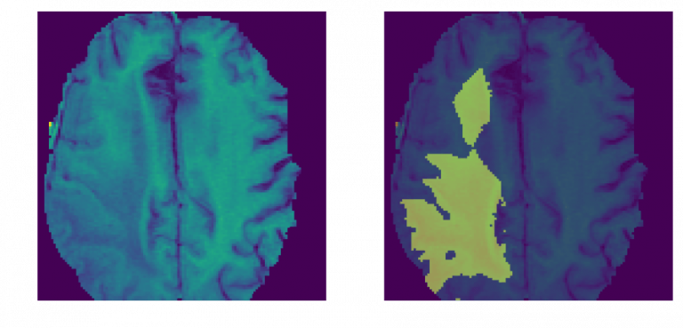
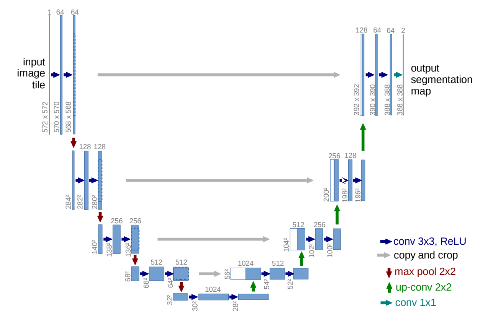

# Brain Tumor Segmentation (BraTS) with Intel® Distribution of OpenVINO™ toolkit

| Details           |              |
|-----------------------|---------------|
| Target OS:            |  Ubuntu\* 18.04 LTS   |
| Programming Language: |  Python* 3.6 |
| Time to Complete:    |  30-40min     |



## What it does

This reference implementation applies the U-Net architecture to segment brain tumors from raw MRI scans. The application plots the brain tumor matter segmented and calculates the [Dice coefficient](https://en.wikipedia.org/wiki/S%C3%B8rensen%E2%80%93Dice_coefficient) between ground truth and the predicted result.

## Requirements
### Hardware
* 6th to 8th Generation Intel® Core™ processor with Iris® Pro graphics or Intel® HD Graphics

### Software
* [Ubuntu\* 18.04 LTS](http://releases.ubuntu.com/18.04/)<br>
   *Note*: We recommend using a 4.14+ Linux* kernel with this software. Run the following command to determine your kernel version:

      uname -a
  
* OpenCL™ Runtime Package
* Intel® Distribution of OpenVINO™ toolkit 2020 R3
* Matplotlib

## How It works

The application uses MRI scans as the input data source. The results from the model are used to calculate Dice coefficient and to plot prediction results of the brain tumor matter segmented.



The Dice coefficient (the standard metric for the BraTS dataset used in the application) for our model is about 0.82-0.88. Menze et al. [reported]( https://ieeexplore.ieee.org/document/6975210 ) that expert neuroradiologists manually segmented these tumors with a cross-rater Dice score of 0.75-0.85, meaning that the model’s predictions are on par with what expert physicians have made. The below MRI brain scans highlight brain tumor matter segmented using deep learning.



### What is U-Net?  
The [U-Net]( https://en.wikipedia.org/wiki/U-Net ) architecture is used to create deep learning models for segmenting [nerves]( https://github.com/jocicmarko/ultrasound-nerve-segmentation ) in ultrasound  images, [lungs]( https://www.kaggle.com/c/data-science-bowl-2017#tutorial ) in CT scans, and even [interference]( https://github.com/jakeret/tf_unet ) in radio telescopes.

U-Net is designed like an [auto-encoder]( https://en.wikipedia.org/wiki/Autoencoder ). It has an encoding path (“contracting”) paired with a decoding path (“expanding”) which gives it the “U” shape. However, in contrast to the autoencoder, U-Net predicts a pixelwise segmentation map of the input image rather than classifying the input image as a whole. For each pixel in the original image, it asks the question: “To which class does this pixel belong?” This flexibility allows U-Net to predict different parts of the tumor simultaneously.



## Setup

### Get the code

Clone the reference implementation: 
```
sudo apt-get update && sudo apt-get install git
git clone https://github.com/intel-iot-devkit/brain-tumor-segmentations.git
``` 

### Install the Intel® Distribution of OpenVINO™ toolkit
Refer to [Install Intel® Distribution of OpenVINO™ toolkit for Linux*](https://software.intel.com/en-us/articles/OpenVINO-Install-Linux) on how to install and setup the Intel® Distribution of OpenVINO™ toolkit.

You will need the OpenCL™ Runtime Package if you plan to run inference on the GPU. It is not mandatory for CPU inference.

### Other dependencies

#### NumPy
NumPy is a library for the Python programming language, adding support for large, multi-dimensional arrays and matrices, along with a large collection of high-level mathematical functions to operate on these arrays.

#### Matplotlib
Matplotlib is a plotting library for the Python programming language and its numerical mathematics extension NumPy. It provides an object-oriented API for embedding plots into applications.

### Which model to use
This application uses a pre-trained model (unet_model_for_decathlon.hdf5), that is provided in the `/resources` directory. This model is trained using the __Task01_BrainTumour.tar__ dataset from the [Medical Segmentation Decathlon](http://medicaldecathlon.com/), made available under the [(CC BY-SA 4.0)](https://creativecommons.org/licenses/by-sa/4.0/) license. Instructions on how to train your model can be found here [https://github.com/IntelAI/unet/tree/master/2D](https://github.com/IntelAI/unet/tree/master/2D)

To install the dependencies of the RI and to optimize the pre-trained model, run the following command:

    cd <path_to_the_Brain_Tumor_Segmentaion_OpenVINO_directory>
    ./setup.sh

### What Input to use

The application uses MRI scans from __Task01_BrainTumour.h5__, that is provided in the `/resources` directory.

## Setup the environment
You must configure the environment to use the Intel® Distribution of OpenVINO™ toolkit one time per session by running the following command:

    source /opt/intel/openvino/bin/setupvars.sh
    
__Note__: This command needs to be executed only once in the terminal where the application will be executed. If the terminal is closed, the command needs to be executed again.
    
## Run the Application

    cd <path_to_the_Brain_Tumor_Segmentaion_OpenVINO_directory>/application

To see a list of the various options:

    ./brain_tumor_segmentation.py -h

A user can specify what target device to run on by using the device command-line argument `-d` followed by one of the values `CPU`, `GPU`, `HDDL`or`MYRIAD`.<br>

### Running on the CPU
Although the application runs on the CPU by default, this can also be explicitly specified through the `-d CPU` command-line argument:
```
./brain_tumor_segmentation.py -r ../results/ -m ../resources/output/IR_models/FP32/saved_model.xml -d CPU --data_file ../resources/Task01_BrainTumour.h5
```
### Running on the integrated GPU
* To run on the integrated Intel® GPU with floating point precision 32 (FP32), use the `-d GPU` command-line argument:

  ```
  ./brain_tumor_segmentation.py -r ../results/ -m ../resources/output/IR_models/FP32/saved_model.xml -d GPU --data_file ../resources/Task01_BrainTumour.h5
  ```
  **FP32**: FP32 is single-precision floating-point arithmetic uses 32 bits to represent numbers. 8 bits for the magnitude and 23 [click here](https:ing-point_format)<br>

* To run on the integrated Intel® GPU with floating point precision 16 (FP16), use the following command:

  ```
  ./brain_tumor_segmentation.py -r ../results/ -m ../resources/output/IR_models/FP16/saved_model.xml -d GPU --data_file ../resources/Task01_BrainTumour.h5
  ```
  **FP16**: FP16 is half-precision floating-point arithmetic uses 16 bits. 5 bits for the magnitude and 10 bits for the precision. For more information, [click here](https://en.wikipedia.org/wiki/Half-precision_floating-point_format)

### Running on the Intel® Neural Compute Stick 2
To run on the Intel® Neural Compute Stick 2, use the `-d MYRIAD` command-line argument.

```
./brain_tumor_segmentation.py -r ../results/ -m ../resources/output/IR_models/FP16/saved_model.xml -d MYRIAD --data_file ../resources/Task01_BrainTumour.h5
```

**Note:** The Intel® Neural Compute Stick 2 can only run FP16 models. The model that is passed to the application, through the `-m <path_to_model>` command-line argument, must be of data type FP16.

### Run on the Intel® Movidius™ Vision Processing Unit (VPU)
To run on the Intel® Movidius™ Vision Processing Unit (VPU), use the `-d HDDL` command-line argument:

```
./brain_tumor_segmentation.py -r ../results/ -m ../resources/output/IR_models/FP16/saved_model.xml -d HDDL --data_file ../resources/Task01_BrainTumour.h5
```

**Note:** The Intel® Movidius™ VPU can only run FP16 models. The model that is passed to the application, through the `-m <path_to_model>` command-line argument, must be of data type FP16.
<!--
### Run on the Intel® Arria® 10 FPGA

Before running the application on the FPGA, set the environment variables and  program the AOCX (bitstream) file.<br>

Set the Board Environment Variable to the proper directory:

```
export AOCL_BOARD_PACKAGE_ROOT=/opt/intel/openvino/bitstreams/a10_vision_design_sg<#>_bitstreams/BSP/a10_1150_sg<#>
```
**NOTE**: If you do not know which version of the board you have, please refer to the product label on the fan cover side or by the product SKU: Mustang-F100-A10-R10 => SG1; Mustang-F100-A10E-R10 => SG2 <br>

Set the Board Environment Variable to the proper directory: 
```
export QUARTUS_ROOTDIR=/home/<user>/intelFPGA/18.1/qprogrammer
```
Set the remaining environment variables:
```
export PATH=$PATH:/opt/altera/aocl-pro-rte/aclrte-linux64/bin:/opt/altera/aocl-pro-rte/aclrte-linux64/host/linux64/bin:/home/<user>/intelFPGA/18.1/qprogrammer/bin
export INTELFPGAOCLSDKROOT=/opt/altera/aocl-pro-rte/aclrte-linux64
export LD_LIBRARY_PATH=$LD_LIBRARY_PATH:$AOCL_BOARD_PACKAGE_ROOT/linux64/lib
export CL_CONTEXT_COMPILER_MODE_INTELFPGA=3
source /opt/altera/aocl-pro-rte/aclrte-linux64/init_opencl.sh
```
**NOTE**: It is recommended to create your own script for your system to aid in setting up these environment variables. It will be run each time you need a new terminal or restart your system. 

The bitstreams for HDDL-F can be found under the `/opt/intel/openvino/bitstreams/a10_vision_design_sg<#>_bitstreams/` directory.<br><br>To program the bitstream use the below command:<br>
```
aocl program acl0 /opt/intel/openvino/bitstreams/a10_vision_design_sg<#>_bitstreams/2019R3_PV_PL1_FP16_RMNet.aocx
```

For more information on programming the bitstreams, please refer to [OpenVINO-Install-Linux-FPGA](https://software.intel.com/en-us/articles/OpenVINO-Install-Linux-FPGA#inpage-nav-11)

To run the application on the FPGA with floating point precision 16 (FP16), use the `-d HETERO:FPGA,CPU` command-line argument:<br>
```
./brain_tumor_segmentation.py -r ../results/ -m ../resources/output/IR_models/FP16/saved_model.xml -d HETERO:FPGA,CPU --data_file ../resources/Task01_BrainTumour.h5
```
-->
